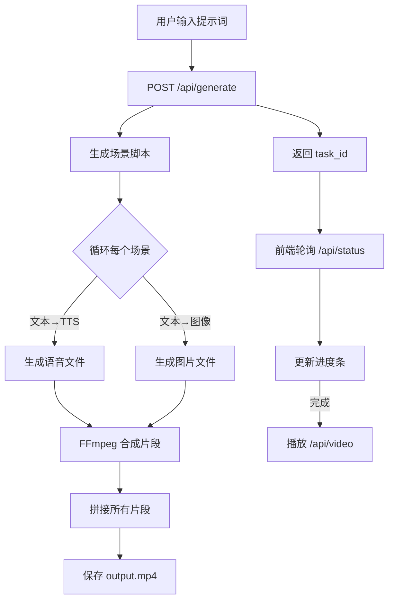

下面是该“自动生成短视频”项目的简要总结，按你的要点组织：

---

## 1. 项目需求

- **目标**  
  - 用户在网页上输入任意提示词（如儿童故事、古诗、英语学习材料等），系统自动生成带画面和配音的短视频。  
- **用户故事**  
  1. 作为 普通用户，我希望在网页输入场景提示，能一键生成完整视频。  
  2. 作为 教学者，我希望能动态定制教学内容并迅速生成演示视频。  
- **功能性需求**  
  - 接收并校验用户输入的“提示词”。  
  - 将提示拆分成若干场景脚本；  
  - 调用 OpenAI 文本（场景脚本）、语音（TTS）和图像 API；  
  - 使用 FFmpeg 将每个场景图像与配音合成视频片段并拼接；  
  - 前端实时展示生成进度；  
  - 生成完毕后可在线播放或下载 MP4。  
- **非功能性需求**  
  - 响应式前端界面，兼容主流浏览器；  
  - 后端高并发任务隔离、临时文件自动清理；  
  - 日志与错误追踪；  
  - 安全地保存 API Key，不在客户端泄露。  
- **验收标准**  
  - 输入任意有效提示词，3 个场景视频在 30 秒内生成完成；  
  - 前端进度条、状态提示与后端真实状态一致；  
  - 生成视频能正常播放且图文、配音同步；  
  - 后端遇错时，前端展示可读的错误消息。

---

## 2. 应用流程及流程图

1. **用户输入** → 2. **提交请求到 `/api/generate`** → 3. **后端拆分场景脚本** → 4. **并行调用 OpenAI TTS 与图像接口** → 5. **FFmpeg 合成每段视频** → 6. **拼接输出 `output.mp4`** → 7. **前端轮询 `/api/status` 更新进度** → 8. **生成完成后前端播放视频**  



---

## 3. 技术栈概览

| 层  | 技术或工具             | 版本 / 说明                                   |
|----|-------------------------|---------------------------------------------|
| 语言 | Python                  | 3.10+                                        |
| 框架 | FastAPI                 | 高性能异步 Web 框架                           |
| AI API | OpenAI API             | ChatCompletion（脚本）、Audio.speech（TTS）、Image |
| 视频合成 | FFmpeg & `ffmpeg-python` | 图像+音频合成、拼接                          |
| 前端 | 原生 HTML/CSS/JavaScript | 无框架，轻量；后期可替换为 React/Vue 等         |
| 运行 | Uvicorn                 | ASGI 服务器                                 |
| 环境管理 | python-dotenv           | 管理环境变量（API Key）                        |

**为什么选它们？**  
- **FastAPI+Uvicorn**：异步、高吞吐，易于写回调进度；  
- **OpenAI**：一站式文本、语音、图像能力；  
- **FFmpeg**：音视频处理标准工具；  
- **原生前端**：零依赖、快速上线，降低调试难度。

---

## 4. 前端与后端指南

### 前端（客户端）

- **编码规范**：ESLint（可选），保持单一职责；  
- **架构模式**：MVC → 简单事件驱动：View（DOM）、Controller（script.js）、Model（状态 task_id/status）；  
- **文件夹结构**：  
  ```
  frontend/
  ├── index.html
  ├── style.css
  └── script.js
  ```  
- **API 协议**：  
  - **POST** `/api/generate` `{ prompt: string } → { task_id }`  
  - **GET** `/api/status/{task_id}` → `{ status, progress, message }`  
  - **GET** `/api/video/{task_id}` → MP4 流  
- **测试策略**：手动输入多种提示，验证进度与视频质量；后期可用 Puppeteer 自动化脚本。  
- **风格规则**：简洁、响应式；进度条渐变；错误提示要醒目。

### 后端（服务器端）

- **编码规范**：遵循 PEP8，类型注解，MyPy（可选）；  
- **架构模式**：  
  - **请求层**：FastAPI 路由  
  - **任务层**：后台线程或 Celery（后期）  
  - **业务层**：`video_generator.py` 封装脚本拆分、TTS、图像、合成逻辑  
- **文件夹结构**：  
  ```
  backend/
  ├── main.py
  ├── video_generator.py
  └── requirements.txt
  ```  
- **API 协议**：同前端一致，并保持 JSON 交互；  
- **测试策略**：  
  - 单元测试：mock OpenAI 接口，验证脚本拆分、文件生成路径；  
  - 集成测试：小规模场景，检查视频文件有效性；  
- **日志与监控**：使用 Python `logging`，记录每个场景步骤与异常。

---

## 5. API、SDK 与技术参考

| 依赖             | 版本／端点                       | 配置示例                                                                          |
|-----------------|--------------------------------|-----------------------------------------------------------------------------------|
| OpenAI Python SDK | `openai>=0.27.0`               | ```python\nopenai.api_key = os.getenv('OPENAI_API_KEY')\n```                       |
| • ChatCompletion | `/v1/chat/completions`         | 生成分场景脚本模型：`gpt-4`                                                        |
| • Audio.speech   | `/v1/audio/speech`             | 生成 TTS，参数：`model='tts-1'`, `input=scene_text`                                |
| • Image.create   | `/v1/images/generations`       | 生成场景配图，参数：`size='512x512'`, `n=1`, `prompt=scene_text`                   |
| FFmpeg           | 系统可执行 `ffmpeg`            | 使用 `ffmpeg-python` 调用；确保 `$PATH` 中含 `ffmpeg`                              |
| fastapi          | `fastapi>=0.90.0`               | Uvicorn 启动：`uvicorn main:app --reload`                                          |
| uvicorn          | `uvicorn[standard]>=0.23.0`    |                                                                                        |
| python-dotenv    | `python-dotenv>=0.21.0`        | `.env` 文件：`OPENAI_API_KEY=你的密钥`                                              |
| aiofiles         | `aiofiles>=23.1.0`             | 异步文件写入（可选）                                                                 |
| pydantic         | `pydantic>=2.0.0`              | 请求模型校验                                                                         |

快速使用示例：

```bash
# 安装依赖
pip install -r backend/requirements.txt

# 配置环境变量（Linux/macOS）
export OPENAI_API_KEY=sk-...

# 启动后端
cd backend
uvicorn main:app --reload
```

前端打开：  
```
http://localhost:8000/static/index.html
```

---

以上即该项目的整体概览。如需更详细的流程图、测试用例或脚本示例，随时告诉我！