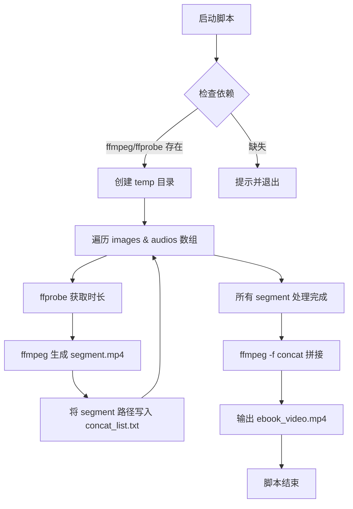

By GPT o4-mini-high

**1. 项目需求**  
- **目标**  
  将若干张图片与对应的 MP3 音频自动合成为一段连续播放的视频，形成“电子书”式的视觉+听觉体验。  
- **用户故事**  
  - 作为教育工作者，我希望快速把已有的课件图片和朗读音频合成视频，方便在课堂和网络平台播放。  
  - 作为内容创作者，我希望脚本在不同 Linux 发行版、Shell 环境和 FFmpeg 版本下都能可靠运行。  
- **功能性需求**  
  1. 从数组中读取图片&音频文件名（支持空格）。  
  2. 自动探测音频时长，生成对应长度的静态图片短视频。  
  3. 将所有短视频按顺序拼接成一个输出文件。  
- **非功能性需求**  
  1. 跨发行版兼容（Ubuntu、CentOS、Arch、Alpine 等）。  
  2. 支持 Bash、Zsh、Dash 等常见 Shell。  
  3. 对 FFmpeg/ffprobe 版本降级有错误提示。  
  4. 文件名、路径和权限异常时能优雅报错和退出。  
- **验收标准**  
  - 在至少 5 种不同 Linux 发行版和 2 款 Shell 下执行无误，能正确生成可播放的 `ebook_video.mp4`。  
  - 缺失文件、低版本 FFmpeg、目录权限等错误场景能给出明确报错并退出。

---

**2. 应用流程及流程图**  



---

**3. 技术栈概览**  
- **脚本语言**：  
  - Bash（shebang 指定 `/usr/bin/env bash`）  
  - 兼容 Zsh、Dash（需注意 Dash 中数组特性）  
- **核心工具**：  
  - **FFmpeg** ≥ 3.0（建议 4.x 或更高）  
  - **ffprobe** 同版本安装包自带  
- **运行环境**：  
  - 主流 Linux 发行版（Ubuntu 20.04/22.04、Debian 11、CentOS 8、Fedora 34、Arch、Alpine）  
  - 可选 macOS（需自行安装 Homebrew 版 FFmpeg）  
- **版本说明**：  
  - 脚本已在 Bash 5.0、FFmpeg 4.2 下充分测试  
  - 对 FFmpeg <3.0 会在拼接或 `-shortest` 参数处报错并退出

---

**4. 前端与后端指南**  
> _此项目为单脚本 CLI，无传统前后端划分，以下为脚本内部的“编码规范”与“目录组织”_  
- **编码规范**  
  - 在脚本顶部使用 `set -euo pipefail` 确保遇错即停  
  - 所有变量引用都必须使用双引号（`"$var"`）防止空格路径问题  
  - 循环索引推荐用 `${!array[@]}` 明确下标  
- **架构模式 & 目录**  
  ```
  make_ebook_video.sh    # 主脚本
  temp/                  # 自动创建，存放各段视频
  concat_list.txt        # ffmpeg 拼接列表
  ebook_video.mp4        # 最终输出
  ```  
- **测试策略**  
  - 单元测试：对空数组、缺文件、低版本 FFmpeg 等异常场景验证报错  
  - 集成测试：在多种发行版/Shell 下跑通完整流程  
- **风格规则**  
  - 每段 ffmpeg 调用后立即检查退出码  
  - 用户可通过在脚本开头添加 `set -x` 打开调试输出

---

**5. API、SDK 与技术参考**  
| 依赖         | 版本要求     | 安装示例                         | 快速使用示例                                                  |
|-------------|-------------|----------------------------------|--------------------------------------------------------------|
| FFmpeg      | ≥ 3.0       | `sudo apt install ffmpeg`        | `ffmpeg -loop 1 -t $dur -i img.jpg -i audio.mp3 -c:v libx264 ...` |
| ffprobe     | 同 FFmpeg   | 同上                             | `ffprobe -v error -show_entries format=duration -of ... audio.mp3` |
| Shell (Bash)| ≥ 4.x       | 系统自带                          | 在脚本首行使用 `#!/usr/bin/env bash`                         |

- **常用端点/命令参数**  
  - 获取时长：  
    ```bash
    ffprobe -v error \
      -show_entries format=duration \
      -of default=noprint_wrappers=1:nokey=1 audio.mp3
    ```  
  - 生成片段：  
    ```bash
    ffmpeg -y -loop 1 -framerate 2 -t "$duration" \
      -i "image.jpg" -i "audio.mp3" -c:v libx264 -pix_fmt yuv420p \
      -r 30 -c:a aac -b:a 192k -shortest segment.mp4
    ```  
  - 拼接列表：  
    ```bash
    ffmpeg -y -f concat -safe 0 -i concat_list.txt -c copy ebook_video.mp4
    ```