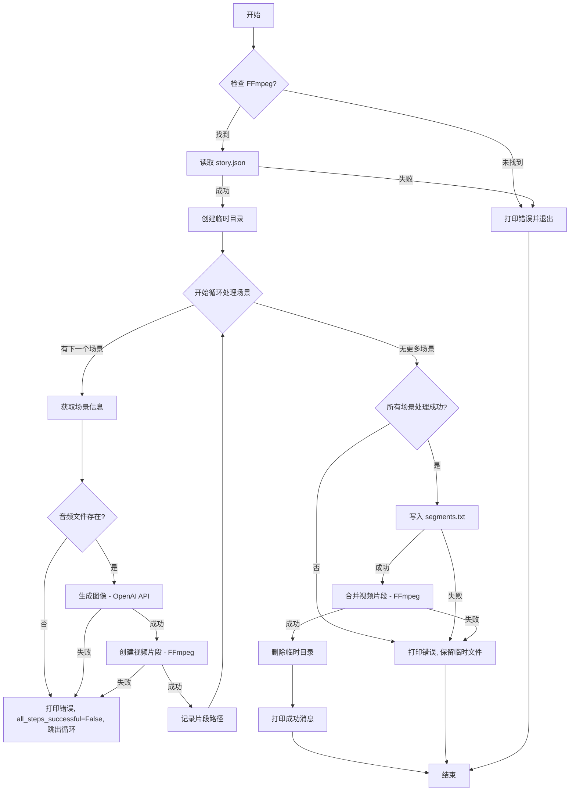

好的，我们来根据您提供的 Python 代码，并结合您列出的五个因素，对该项目使用的技术进行总结。

---

**技术总结：自动化电子书视频生成脚本**

这是一个基于 Python 的命令行脚本，旨在自动化地将结构化的故事内容（包含文本提示和音频文件）转换为视频。它通过调用外部服务（OpenAI DALL-E）生成图像，并使用本地工具（FFmpeg）将图像和音频合成为视频片段，最终拼接成一个完整的视频文件。

**1. 项目需求**

* **目标:** 主要目标是简化从文本/音频故事创建视频内容的过程。用户提供一个结构化的 JSON 文件描述故事的每个场景（包括图像描述和对应的音频文件路径），脚本自动生成一个配有图像和音频的视频。
* **用户故事 (推断):**
    * 作为内容创作者，我希望能提供一个包含场景描述和音频文件的 JSON 文件，以便自动生成一个带有对应画面和声音的视频，从而节省手动编辑视频的时间。
* **功能性需求:**
    * 读取并解析 `story.json` 文件。
    * 检查必要的外部依赖（FFmpeg）是否存在。
    * 为 JSON 中定义的每个场景：
        * 调用 OpenAI API（特别是图像生成模型如 DALL-E 3），根据提供的文本提示 (`image_prompt`) 生成图像。
        * 使用 FFmpeg 将生成的图像和指定的音频文件 (`audio_file`) 合并成一个视频片段（.mp4）。
    * 将所有生成的视频片段按顺序拼接成一个最终的视频文件 (`ebook_video.mp4`)。
    * 在处理过程中提供清晰的进度和错误信息。
    * 自动创建和管理临时文件目录。
    * 成功生成视频后自动清理临时文件。
    * 在发生错误时保留临时文件以供调试。
* **非功能性需求:**
    * **易用性:** 需要用户预先安装 FFmpeg 并设置 OpenAI API 密钥。输入格式固定为 JSON。
    * **可配置性:** 视频尺寸、图像尺寸、使用的 OpenAI 模型、图像风格提示以及输入/输出文件名可通过脚本顶部的常量进行配置。
    * **错误处理:** 脚本包含对文件未找到、JSON 解析错误、API 调用失败、FFmpeg 执行错误等常见问题的基本处理。
    * **依赖性:** 强依赖于 OpenAI API 的可用性和 FFmpeg 的正确安装。
* **验收标准 (推断):**
    * 脚本成功运行时，输出一个名为 `ebook_video.mp4` 的视频文件。
    * 视频内容包含与 `story.json` 中场景数量相对应的片段序列。
    * 每个片段的画面是根据对应场景的 `image_prompt` 生成的（并应用了指定的风格），声音是对应的 `audio_file`。
    * 视频的总时长约等于所有音频文件时长的总和。
    * 成功执行后，`temp_video_files` 目录被删除。
    * 若执行失败（如缺少 FFmpeg、API 密钥无效、文件丢失等），脚本应打印明确的错误信息并退出，同时保留 `temp_video_files` 目录。

**2. 应用流程及流程图**

**流程步骤:**

1.  **启动:** 脚本开始执行。
2.  **检查依赖:** 调用 `check_ffmpeg()` 检查 FFmpeg 是否已安装并在系统路径中。如果未找到，打印错误并退出。
3.  **读取故事:** 打开并解析 `story.json` 文件。如果文件不存在或格式无效，打印错误并退出。
4.  **创建临时目录:** 创建 `temp_video_files` 目录用于存放中间文件（图片、视频片段、片段列表）。
5.  **循环处理场景:** 遍历 `story.json` 中的每个场景对象：
    a.  **获取场景信息:** 提取 `image_prompt` 和 `audio_file` 路径。
    b.  **检查音频文件:** 验证 `audio_file` 是否存在。如果不存在，打印错误并可能中止整个过程（或跳过该场景，当前代码是中止）。
    c.  **生成图像:** 调用 `generate_image()` 函数：
        i.  组合用户提示和预设风格提示 (`IMAGE_STYLE_PROMPT`)。
        ii. 调用 OpenAI `client.images.generate()` API，使用指定的模型 (`IMAGE_MODEL`) 和尺寸 (`IMAGE_SIZE`) 请求 base64 编码的图像。
        iii. 解码 base64 数据并将图像保存到临时目录（如 `image_scene_1.png`）。
        iv. 如果 API 调用失败或返回空数据，打印错误并中止整个过程。
    d.  **创建视频片段:** 调用 `create_video_segment()` 函数：
        i.  使用 `subprocess.run()` 执行 `ffmpeg` 命令。
        ii. 命令参数包括：循环输入的图像、输入的音频文件、视频滤镜（调整图像大小以适应目标视频尺寸 `VIDEO_WIDTH`x`VIDEO_HEIGHT`，并设置像素格式）、视频/音频编解码器、音频比特率，并设置输出时长与音频时长一致 (`-shortest`)。
        iii. 将生成的片段保存到临时目录（如 `segment_1.mp4`）。
        iv. 如果 FFmpeg 执行失败，打印错误并中止整个过程。
    e.  **记录片段路径:** 将生成的片段文件名（相对于临时目录）添加到 `generated_segments` 列表中，格式为 `file 'segment_1.mp4'`。
6.  **检查处理结果:** 如果循环过程中任何步骤失败 (`all_steps_successful` 为 False)，则跳过合并步骤。
7.  **写入片段列表:** 如果所有场景处理成功，将 `generated_segments` 列表的内容写入临时目录下的 `segments.txt` 文件，每行一个片段路径。
8.  **合并视频:** 调用 `concatenate_videos()` 函数：
    a.  使用 `subprocess.run()` 执行 `ffmpeg` 命令。
    b.  使用 `concat` demuxer 读取 `segments.txt` 文件。
    c.  使用 `-c copy` 直接复制代码流（快速，无重编码）合并所有片段。
    d.  将最终视频保存为 `FINAL_VIDEO_NAME`（如 `ebook_video.mp4`）。
    e.  如果 FFmpeg 执行失败，打印错误。
9.  **清理:** 如果整个过程（包括合并）都成功且最终视频文件存在：
    a.  删除 `temp_video_files` 临时目录及其所有内容。
    b.  打印成功消息和最终文件名。
10. **结束:** 如果过程中有错误，打印错误消息并提示临时文件已保留在 `temp_video_files` 目录。脚本执行完毕。

**流程图 (文字描述):**



**3. 技术栈概览**

* **编程语言:**
    * **Python:** (版本未指定，但从语法看应为 Python 3.6+，推荐 3.7+ 以获得更佳的 `subprocess` 支持)。 *为什么:* Python 拥有丰富的标准库、强大的第三方库生态（如 `openai`）、易于读写，并且非常适合编写脚本和自动化任务。
* **核心库 (Python 标准库):**
    * `json`: *什么:* 用于解析输入的 `story.json` 文件。 *为什么:* 标准库功能，无需额外安装，是处理 JSON 数据的标准方式。
    * `os`: *什么:* 用于文件系统交互，如创建目录 (`makedirs`)、检查文件存在性 (`exists`)、拼接路径 (`join`)、获取文件大小 (`getsize`)。 *为什么:* 提供跨平台的操作系统接口。
    * `subprocess`: *什么:* 用于执行外部命令行程序，主要是 `ffmpeg`。 *为什么:* 在 Python 中调用外部进程的标准方式。
    * `base64`: *什么:* 用于解码从 OpenAI API 收到的 Base64 编码的图像数据。 *为什么:* OpenAI API 选择返回这种格式，需要用此库解码。
    * `shutil`: *什么:* 用于高级文件操作，如查找可执行文件 (`which`) 和递归删除目录 (`rmtree`)。 *为什么:* 提供了比 `os` 更方便的文件操作函数。
    * `sys`: *什么:* 用于系统相关功能，如此处用于退出脚本 (`exit`)。 *为什么:* 标准库，提供对解释器变量和函数的访问。
* **外部 Python 库:**
    * `openai`: *什么:* OpenAI 官方提供的 Python 客户端库 (代码中初始化方式 `OpenAI()` 表明是 v1.0.0 或更高版本)。 *为什么:* 简化了与 OpenAI API（包括 DALL-E 图像生成）的交互。
* **外部工具/依赖:**
    * **FFmpeg:** *什么:* 一个功能强大的、开源的音视频处理命令行工具。 *为什么:* 它是处理音视频转换、编解码、滤镜应用和文件合并的事实标准，功能全面且高效。脚本依赖它来创建视频片段和最终合并。
* **外部服务:**
    * **OpenAI API:** *什么:* 由 OpenAI 提供的云服务，此脚本使用其图像生成能力（可能是 DALL-E 3 或类似模型）。 *为什么:* 提供先进的 AI 图像生成功能，是实现“文本到图像”需求的核心。

**4. 前端与后端指南 (推断与观察)**

由于这是一个单一的命令行脚本，没有传统的前后端分离。我们可以根据代码风格和结构推断其内部的“指南”。

* **适用对象:** 这是一个后端/命令行工具，没有前端界面。
* **编码规范 (观察到的):**
    * **命名:** 常量使用全大写字母加下划线 (`TEMP_DIR`)，函数和变量使用蛇形命名法 (`generate_image`, `story_data`)。
    * **注释:** 代码包含对常量、函数目的和关键步骤的注释。
    * **格式化:** 使用 f-string 进行字符串格式化。代码结构清晰，有函数划分。
    * **错误处理:** 使用 `try...except` 块捕获特定类型的错误（`FileNotFoundError`, `JSONDecodeError`, `APIError`, `CalledProcessError`, `Exception`），并提供相应的错误信息。
    * **入口点:** 使用 `if __name__ == "__main__":` 保护主执行逻辑。
* **架构模式:** 简单的过程式脚本，通过函数分解实现模块化。可以看作是一个基本的**管道 (Pipeline)** 模式：数据（故事信息）依次通过图像生成、片段创建、合并等阶段处理。
* **文件夹结构 (隐式):**
    * 脚本本身（`.py` 文件）。
    * 输入的 `story.json` 文件（应与脚本在同一目录或提供正确路径）。
    * 输入的音频文件（路径在 `story.json` 中指定，需对脚本可访问）。
    * 执行时创建的 `temp_video_files/` 目录（包含中间 `.png`, `.mp4`, `.txt` 文件）。
    * 最终输出的 `ebook_video.mp4` 文件（默认在脚本所在目录）。
* **API 协议约定:**
    * **内部:** 无内部 API。
    * **外部 (OpenAI):** 通过 `openai` 库与 OpenAI 的 RESTful API 交互。请求图像时指定了模型、提示、数量、尺寸和响应格式 (`b64_json`)。认证通过环境变量 `OPENAI_API_KEY` 实现。
* **测试策略 (推断):**
    * 代码中没有包含单元测试或集成测试。
    * 测试可能依赖于手动运行脚本，提供不同的 `story.json` 输入（包括有效和无效数据、存在和不存在的音频文件），并检查控制台输出和最终生成的视频文件是否符合预期。
* **风格规则:** 大体遵循 PEP 8 Python 风格指南。

**5. API、SDK 与技术参考**

* **OpenAI API:**
    * **SDK:** `openai` Python library (v1.0.0+). 安装：`pip install openai`.
    * **服务:** 图像生成 (Image Generation).
    * **端点 (通过 SDK 间接访问):** 类似 `https://api.openai.com/v1/images/generations`.
    * **模型:** 由 `IMAGE_MODEL` 常量指定 (例如 `"dall-e-3"` 或代码中提到的 `"gpt-image-1"`).
    * **版本:** API 版本通常是 v1.
    * **配置:** 需要设置环境变量 `OPENAI_API_KEY` 为你的 API 密钥。
    * **快速使用示例 (来自代码):**
        ```python
        from openai import OpenAI
        client = OpenAI() # Assumes OPENAI_API_KEY is set
        response = client.images.generate(
            model="dall-e-3", # Or IMAGE_MODEL
            prompt="A cute cat wearing a hat",
            n=1,
            size="1024x1024", # Or IMAGE_SIZE
            response_format="b64_json"
        )
        image_b64 = response.data[0].b64_json
        # ... decode and save ...
        ```
* **FFmpeg:**
    * **SDK:** 无 (直接通过命令行调用)。
    * **类型:** 命令行工具。
    * **端点:** N/A.
    * **版本:** 未指定，但需要支持所用参数（如 `-loop`, `-shortest`, `-vf scale/pad`, `libx264`, `aac`, `concat` demuxer）。大多数现代版本应该兼容。
    * **配置:** 必须安装在系统上，并且其可执行文件路径需要在系统的 `PATH` 环境变量中。
    * **快速使用示例 (来自代码 - 片段创建):**
        ```bash
        ffmpeg -loop 1 -i input_image.png -i input_audio.mp3 \
               -vf "scale=1280:720:force_original_aspect_ratio=decrease,pad=1280:720:(ow-iw)/2:(oh-ih)/2,format=yuv420p" \
               -c:v libx264 -tune stillimage -c:a aac -b:a 192k \
               -shortest output_segment.mp4
        ```
    * **快速使用示例 (来自代码 - 合并):**
        ```bash
        # Assuming segments.txt contains:
        # file 'segment_1.mp4'
        # file 'segment_2.mp4'
        ffmpeg -f concat -safe 0 -i segments.txt -c copy final_video.mp4
        ```

---

这个总结涵盖了您要求的五个方面，详细说明了脚本的目标、工作流程、所依赖的技术栈、编码实践以及外部依赖的细节。